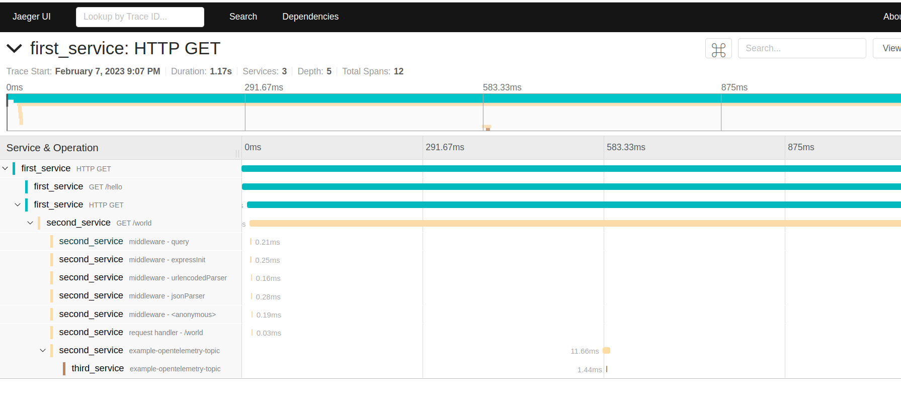

**Running:**
- build tools. Kafka, jaeger and etc. See docker-compose file
  - `docker compose up`
-  use .env file for configuring environment. See the example in 'environments' folder
- execute commands from first_service, second_service and third_service directories for start apps
  - `npm install`
  - `npm run start:dev`

**Test**
- Make a GET request for the first_service
  - `http://localhost:3000/hello`
- For check tracing go to jaeger `http://localhost:16686`
- For check metrics go to prometheus `http://localhost:9090`

